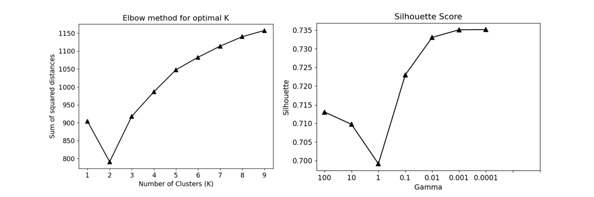
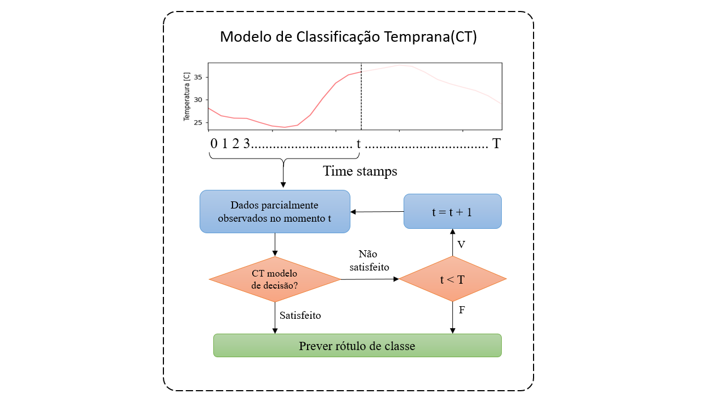

## Projeto <Clima e saúde>

## Descrição resumida do projeto :

Este projeto consiste na análise de dados de temperatura e umidade para mapear condições climáticas saudáveis que contribuam para 
o bem estar das pessoas que vivem na cidade de Campinas SP.
Para realização deste projeto foram utilizadas duas bases de dados principais : A base de dados da Cepagri que possui dados de temperatura e umidade
no período de 1997 a 2018 e a base de dados da Cetesb nos meses de janeiro a maio de 2020.
Foi realizado  o pré processamento dos dados  para correção os dados faltantes em ambas as bases e foram realizados cálculos para encontrar três
indicadores que caracterizam o conforto térmico de uma pessoa com relação ao ambiente, são eles : humidex, ondas de calor, ondas de frio.
Após ter encontrado os indicadores foram aplicados algoritmos de clusterização para identificar condições saudáveis de clima que contribuam para o bem estar das pessoas.

## Abstract :

This project consists of analyzing temperature and humidity data to map healthy climatic conditions that contribute to
the welfare of people living in the city of Campinas SP.
To carry out this project, two main databases were used: The Cepagri database, which has temperature and humidity data
from 1997 to 2018 and the Cetesb database from January to May 2020.
Pre-processing of data was performed to correct missing data in both databases and calculations were performed to find three
Indicators that characterize a person's thermal comfort in relation to the environment are: humidex, heat waves, cold waves.
After finding the indicators, clustering algorithms were applied to identify healthy climate conditions that contribute to people's well-being.

## Equipe :
Daniel Filipe Vieira RA : 262720

Ruben Hernan Alcivar Ullon RA: 262729

## Video do projeto

https://drive.google.com/file/d/162rskPRvc0Ap1H90L5hTd58whU9q7zAJ/view?usp=sharing

## 1. Introdução e motivação

Um tema muito recorrente atualmente são as mudanças climáticas que o mundo vem sofrendo ao longo do tempo. Aquecimento global, efeito estufa e derretimento de geleiras
polares são efeitos associados ao tema em questão [1].
A atividade humana está  diretamente ligada á essas alterações climáticas aumentando a concentração de gases tóxicos como dióxido de carbono na atmosfera devido a queima de combustíveis fósseis e de florestas  contribuindo para o aumento do efeito estufa [2].
Por outro lado essas mudanças climáticas afetam diretamente a saúde das pessoas como por exemplo em períodos de maior estresse térmico (longos períodos com temperaturas muito baixas ou muito altas) ou acidentes naturais como enchentes e tempestades e também de forma indireta afetando a qualidade do ar , da água , interferindo nos vetores de transmissão de doenças [4].
Partindo desse principio que as mudanças climáticas afetam diretamente a saúde humana o presente projeto pretende calcular indicadores através das medidas coletadas de temperatura e umidade : Humidex, ondas de calor.

                                       Figura 1 - Ambiente

Na figura 2 é possível visualizar os principais problemas ocasionados pelas ondas de calor.

                     Figura 2 - Problemas ocasionados pela presença das ilhas de calor
                     
Partindo deste contexto este projeto utiliza duas bases de dados, a base principal do projeto foi cedida pelo Centro de Pesquisas Meteorológicas e Climáticas aplicada a Agricultura (Cepagri), a Cepagri coleta dados de temperatura, umidade, direção do vento, intensidade de radição solar através de uma estação meteorológica que fica localizada dentro do Campus da Universidade Estadual de Campinas (Unicamp), na cidade de Campinas SP .
E uma segunda base de dados disponível no site da  Companhia Ambiental do Estado de São Paulo (Cetesb) também foi utilizada para comparar os dados de temperatura e umidade nos meses de março a maio de 2020 com os dados referentes a estas mesmas variáveis no periodo de 2017 a 2018.

A escolha do período de janeiro a maio de 2020 para analisar  se houve alterações climáticas, justifica-se  em virtude do isolamento social devido a pandemia causada pelo Covid 19.
Após a escolha dos datasets para o projeto foram estudadas e aplicadas técnicas para limpeza destes dados e por fim, aplicou -se a metodologia KDD (Knowledge Discovery in Databases – KDD) para obter conhecimento a partir dos dados (tais como níveis de temperatura e umidade ) e assim  calcular três principais indicadores de condições climáticas: Humidex, ilhas de calor, ilhas de frio.

A partir do cálculo destes indicadores realizar a classificação (clusterização) dos dados utilizados para se identificar condições climáticas saudáveis a partir de dados de temperatura e umidade e assim poder fazer recomendações para as pessoas dos cuidados que devem ser considerados para evitar que condições climáticas desfavoráveis como a presença de ondas de calor , ondas de frio e umidade relativa do ar baixa afetem a saúde das pessoas .

## 2. Pergunta de pesquisa

É possível a identificação de condições climáticas saudáveis  a  partir de dados de temperatura e umidade ?

## 3. Objetivos do projeto

* Realizar a análise exploratória dos dados de temperatura e umidade da base de dados do Cepagri e da Cetesb utilizando a técnica KDD

* Cálculo dos indicadores como humidex e ondas de calor.

* Identificar condições climáticas desfavoráveis de acordo com os indicadores calculados, para fazer recomendações de hábitos saudáveis nas pessoas.

## 4. Recursos e métodos

* 4.1. Bases de dados

|Base de dados   |Endereço na web   |Resumo e descrição de uso    |
|---|---|---|
| Base 1 - Cepagri da Unicamp  |  |Essa foi a principal base de dados utilizada no projeto, nessa base foram aplicadas técnicas para completar os dados faltantes, foram realizados cálculos para encontrar os indicadores humidex, onda de calor, onda de frio.   |
| Base 2  - Cetesb  |https://cetesb.sp.gov.br/ar/dados-horarios/  | Esta base de dados foi utilizada para efeitos de comparações entre os meses de janeiro  maio de 2020  e o mesmo período do ano passado  |

* 4.2 Ferramentas

Toda a análise foi feita na ferramenta de notebook jupyter na linguagem de programação Python (Versão 3.6), no entanto, vale mencionar as bibliotecas externas usadas no projeto:

| bibliotecas  | Endereço web  | Descrição de uso  |
|---|---|---|
| tslearn  | https://tslearn.readthedocs.io/en/stable/index.html  |   |
| scikit-learn  | https://scikit-learn.org/stable/  |   |

* 4.3. Metodologia

A metodologia adotada neste projeto foi a Knowledge Discovery in Data (KDD) , que é a descoberta de conhecimento a partir de uma base de dados[6].
E pode ser ilustrada na figura 3

                                 Figura 3 - Processo de estração do conhecimento a partir do processo KDD 

Com base nessa metodologia, __técnicas estatísticas__ como histogramas e medidas de dispersão foram utilizadas nas etapas de seleção e pré-processamento, com o objetivo de conhecer e manipular o conjunto de dados da melhor maneira. Além disso, __técnicas matemáticas e de visualização__ seriam aplicadas no estágio de pré-processamento para evitar todo tipo de missing data ou a presença de outliers.

Posteriormente, já em fase de transformação, novos parâmetros foram calculados, como os índices Humidex e as ondas de calor. Para os quais foram considerados os seguintes critérios:

O __Humidex__ foi proposto em 2016 e é descrito como uma métrica do desconforto térmico de uma pessoa em uma determinada condição de temperatura e umidade relativa do ar  [7].

O humidex é definido pela fórmula:
H = T + (0:555:[E - 10]); (2)
onde T é a temperatura em Graus Celsius e E é a pressão de vapor de água em milibars.
A pressão de vapor é descrita pela fórmula:
E = 6:11.e^5417:7530:( 1 /273.16 -  1 /td+ 273.16)

água para que haja condensação em unidades de graus Celsius.
Utilizamos uma aproximação para o ponto de orvalho (td) que leva em consideração a temperatura e
a umidade relativa, descrita em [8].
td = T - 100 - RH/5
Onde T é a temperatura e RH é a umidade relativa

Ele pode ser classificado conforme a tabela 1

|Valor de humidex    |Sensação térmica             |   
|---                 |---                          |
| Menor que 29       |Sem desconforto              |   
| De 30 a 39         |Desconforto ameno            |   
  De 40 a 45           |Desconforto, evitar esforço  |
  Acima de 45          |  Perigo                     |
  Acima de 54          |  Insolação iminente         |
  
  
Respeito as __Ondas de calor__ na literatura não existe um consenso na definição de ondas de calor , podendo ser definida como temperaturas que excedem 35 ºC . ou de forma mais flexivel como um período de dias consecutivos com temperaturas acima do percentil 95.

Para o estudo em questão utilizaremos o indice CTXP90  (valor do corte a partir do P90 de temperaturas máximas em um intervalo de 15 dias e o Heat Wave Magnitude Index (HWMI) 
Com base nos indices CTXP90 e HDWI apresentados , respectivamente em [3] e [9] adotou - se como definição de onda de calor um período de 2 ou mais dias consecutivos com temperaturas máximas acima do percentil 90 de temperaturas em uma janela de 30 dias centrada no dia de avaliação  calculada no histórico de 22 anos disponiveis Para a marcação de dias de calor  seguiu -se o seguinte algoritmo:

1 - Para cada dia d calcula -se o percentil 90 (P90(d)) das temperaturas máximas situadas no intervalo de dias [d -15, d+15] para todos os anos da base.

2 - Percorre -se todas as observações da base até que se chegue a condição:

Se a temperatura máxima dos dias d, d +1 e d +2 forem maiores que P90(d), P90 (d+1) e P90(d+2) , entao em d inicia -se uma onda de calor.
 

3 - Encontrado um inicio de onda de calor define -se i = 0
Enquanto a temperatura máxima em d+2 +i for maior que  P90(d + 2 + i ) marca -se d+2 + i como uma onda de calor e incrementa -se i (i = i+1)

4 - OS passos 2 e 3 são repetidos até que todas as observações da base estejam marcadas como ondas de calor ou não.

Como as informações que temos são definidas em função do tempo, os algoritmos de __aprendizado de máquina__ foram adaptados para reconhecer padrões e comportamentos na forma de __séries temporais__.

## 5. Detalhamento do projeto

__Etapa 1 -__  Entendimento do problema - Nesta etapa o objetivo principal é entender o motivo que justifica a escolha do processo KDD, portanto a pergunta de pesquisa é quem guiará o processo  do ponto de vista do que ou quem utilizará esse conhecimento. Neste projeto esta etapa foi cumprida por meio de reuniões da dupla e pesquisas na literatura para encontrar bases teóricas sobre os problemas ocasionados pelas mudanças climáticas na saúde humana.

__Etapa 2 - Selection (Seleção)  -__ Nesta etapa foi feita a seleção do período do dataset que seria utilizado para realizar a análise.
Para o dataset fornecido pela Cepagri foram  escolhidos os meses de janeiro a dezembro para os anos de 2017 e 2018 , já para o dataset da Cetesb foram escolhido os meses de janeiro, fevereiro, março, abril e maio e as variáveis selecionadas em ambas as bases  foram temperatura e umidade

Link de notebook 1 [Selection]

__Etapa 3 - Preprocess -__ Para uma análise de séries temporais, é muito importante que cada um dos registros tenha sua data e hora em que essas informações foram registradas. O formato da data e hora do conjunto de dados foi dividido em três campos: Ano, Dia Juliano e Hora-Minuto. Portanto, foi necessário aplicar um algoritmo que alterasse esse formato para: __AAAA/mm/dd HH:MM__, a técnica utilizada foi baseada no seguente codigo:
~~~python
from datetime import datetime
jdate = year+'-'+julian_day+'-'+hour+'-'+minute
fmt = '%Y-%j-%H-%M'
date_time = datetime.strptime(jdate, fmt)
~~~
Após foi realizado um pré processamento utilizando a técnica de interpolação dos valores no ano de 2017 e 2018 para completar os valores faltantes de temperatura e umidade da base fornecida pelo Cepagri. Um exemplo da perda de dados é amostrada na Figura 4.

Por outro lado, a detecção de outliers foi realizada apenas para dados extremamente anômalos, pois se nosso estudo se basear na busca por condições climáticas extremas incomuns, um processo como o boxplot nos deixaria sem informações relevantes. Portanto, apenas através de estatisticas como a visualização da distribuição das variáveis, média e desvio padrão, tais problemas foram identificados.

__Etapa 4 - Transformation -__ Essa etapa começou com a integração dos 2 conjuntos de dados mencionados anteriormente, já pensando no que seriam os grupos de treinamento e teste dos algoritmos de aprendizado de máquina. Na Figura 6, podemos visualizar a integração.

Posteriormente, novos parâmetros, como o índice Humidex, foram calculados para cada medição de temperatura e umidade, usando o seguinte segmento de código:
~~~python
def get_humidex(T,H):
    z = 6.112*(10**((7.5*T)/(237.7+T)))*(H/100)
    return T+((5/9)*(z-10))
~~~
A partir desse cálculo foi possível classificar a condição climática em função desse indicador como : Confortable (confortável ) , some disconfort (algum desconforto). No entanto, os dados do Humidex precisavam ser preparados para um processo posterior de aprendizado de máquina, em que cada linha do Dataframe representaria uma data e cada coluna o valor para cada hora ao longo do dia, ou seja, cada linha formaria uma série temporal. Um exemplo é amostrado na Figura 6.

__Etapa 5 - Data mining -__ Nesta etapa após realizar o pré processamento e a transformação dos dados dos datasets colocando esses dados num formato mais adequado para realizar a análise, a técnica de clusterização foi aplicada de acordo com o indicador Humidex.

O algoritmo de agrupamento escolhido para esse processo foi o K-Means adaptado para séries temporais. Onde sua implementação será descrita nas seguintes etapas:

O algoritmo K-Means precisa ajustar certos parâmetros, como métrica de distância, inicialização e número do cluster Apriori.

1. A métrica de distância foi escolhida com base em seu desempenho no final da clusterização, onde a métrica Soft-DTW superou as demais. Uma ilustração de como essa métrica funciona é mostrada abaixo.

2. Uma vez escolhida a métrica, a inicialização acordada para este estudo foi aleatória.
3. Para definir o número ideal de grupos (K), a técnica do cotovelo foi utilizada com base na soma dos quadrados dos erros em que foi escolhido um K = 2. No entanto, essa etapa não terminaria até a escolha do parâmetro de aprendizado da métrica Soft-DTW, para a qual foi utilizado o critério do maior coeficiente de silhueta.

4. Finalmente, o algoritmo K-Means foi executado com os seguentes parâmetros:
* K = 2
* metric = softdtw
* gamma = 1e-4
* init = random

Eles garantiram o melhor desempenho no conjunto de dados, com um coeficiente de silhueta de 0.7351. 

__Etapa 6 - Extract Knowledge -__ Esta etapa usou o conhecimento adquirido com o agrupamento para fazer uma classificação precoce do tipo de dia que as pessoas experimentariam. O processo de treinamento desse algoritmo utilizou os dados rotulados dos anos de 2017 e 2018 e foi testado com os dias de 2020. Esse algoritmo consiste em dois parâmetros de ajuste: lambda e cost, com a combinação destes foi procurado o Trade-off de sacrificar a precisão pelo tempo mínimo (t) para classificar uma série temporal corretamente. 

O processo para determinar a classificação temprana de uma série temporal é mostrado na Figura 9.

## 6. Evolução do projeto

Inicialmente  nossa intenção era de realizar o projeto com dados de poluição do ar atmosférico e classificar o ar de acordo com a quantidade de polentes no ar, porém diante da dificuldade em achar datasets com esse tipo de dados, optamos por trabalhar com dados de temperatura e umidade, uma vez que estão disponíveis pela Cepagri e no site da Cetesb.

Em seguida, foram realizadas pesquisas sobre indicadores baseados em temperatura e umidade que ajudariam a identificar condições climáticas que afetam a saúde das pessoas. Inicialmente, escolhemos Humidex, ondas de calor e frio, mas como a região de análise era a cidade de Campinas, os resultados para ondas de frio nos anos escolhidos não eram tão relevantes, portanto, focamos em altas temperaturas e sensações térmicas(Humidex).

De acordo com a escala dos valores Humidex, esperávamos encontrar 4 grupos no processo de agrupamento, mas percebemos que os valores Humidex foram encontrados nas 2 faixas menores (Menos de 29, Sem desconforto)(De 30 a 39, Desconforto ameno), poucos valores permaneceram em (De 40 a 45, Desconforto, evitar esforço) e nenhum (Acima de 45, Perigo). Por isso, entendemos que nas avaliações do melhor valor de K, a clusterização com dois grupos superou os demais.

|Nivel    |Quantidade             |   
|---      |---                    | 
|comfortable       |  14717|
|great discomfort  |    199|
|some discomfort   |   6252|

Quando obtivemos os resultados do agrupamento, tentamos ir além do simples reconhecimento de padrões e procurar uma maneira de ajudar as pessoas no futuro de uma maneira mais eficiente. Por isso, decidimos usar o conhecimento obtido pelo processo de agrupamento para criar um classificador inicial que nos permitisse rotular o tipo de dia que as pessoas experimentariam com base nas temperaturas e umidade das primeiras 12 horas do dia. Esse resultado seria de grande importância para as pessoas se conscientizarem quando saírem para fazer algum esforço físico.

Acreditamos que o estudo é relevante devido à sua capacidade de adaptação a qualquer outra região ou cidade, utilizando apenas dados de temperatura e umidade.

## 7. Resultados e discussões

Para entrar em contexto com os resultados do estudo, mostraremos o conjunto de dados com as informações dos anos de 2017 e 2018 das temperaturas em função do tempo, adicionando uma classificação de cores para os intervalos de umidade.

Já nesta primeira visualização, podemos ver certo comportamento repetitivo entre esses dois anos. Portanto, esse grupo de dados foi transferido para um formato de série temporal, onde realizamos um diagrama em espiral, que demonstrou um padrão repetitivo das horas com as temperaturas mais altas nos dois anos.

<figure>
  
</figure>

_Figura 11. Spiralogram dos anos de 2017 e 2018, para as temperaturas máximas a cada hora do dia, com as temperaturas mais altas durante o dia no intervalo das 13:00 às 17:00._

Após as primeiras análises em nosso conjunto de dados e a implementação do algoritmo de clusterização K-Means descrito no capítulo anterior, mostraremos o agrupamento das séries temporais obtidas pelo algoritmo:

~~~python
TimeSeriesKMeans(init='random', max_iter=20, metric='softdtw',
                 metric_params={'gamma': 0.0001}, n_clusters=2, random_state=0,
                 verbose=True)
~~~

_Figura 12. Agrupamento de séries temporais para a variável Humidex nos anos 2017,2018 e 2020. As curvas vermelhas representam os dias da classe 0 (desconforto) e o azul da classe 1 (sem desconforto)._

Como parte da validação desse processo de clusterização, foi aplicado o algoritmo de redução de dimensionalidade t-SNE, para o qual o dataframe mostrado na parte inicial do estágio de [DataMining](https://github.com/hernanullon/ClimaticHealthy/blob/master/notebooks/3%20%5BTransformation%5D.ipynb) foi usado em conjunto com as previsões obtidas pelo K-Means. A partir da Figura 13, podemos reconhecer que os grupos obtidos estão bem agrupados, talvez com dificuldades na região de fronteira, para a qual o coeficiente de silhueta obtido (0,73514) faz sentido.

_Figura 13. Redução de dimensionalidade com t-SNE do dataframe de 48 colunas para 2, onde os pontos vermelhos representam os dias de desconforto e o azul de conforto._

## 8. Conclusões

## 9. Trabalhos futuros

Para trabalhos futuros pretendemos aplicar o algoritmo de clusterização para encontrar condições saudáveis a partir de dados coletados de concentrações de CO2, CO emitidos por  um ônibus convencional e por um ônibus elétrico para se realizar a comparação das condições do ar atmosférico de uma região a partir da substituição de um ônibus convencional 
por um ônibus elétrico.
  
## 10.  Referências

[1] As cidades que queremos Disponível em : <https://www.isglobal.org/es/ciudadesquequeremos?gclid=Cj0KCQjw1Iv0BRDaARIsAGTWD1s8PaszWCMZQG9CKFIHkiV-2PVh2Q8oZ8vWFKcxVEHfRHLJwXDFVOQaAvi8EALw_wcB#efectossalud>

[2] W. H. ORGANIZATION, ed., Climate Change and Human Health - Risks and Responses, Genève, 2004.
OCLC: 254297040.
Disponível em < https://apps.who.int/iris/bitstream/handle/10665/44133/9789241598187_eng.pdf;jsessionid=F45966ED878C58D6CC7129FFE87DF3B0?sequence=1>

[3] S. RUSSO, A. DOSIO, R. G. GRAVERSEN, J. SILLMANN, H. CARRAO, M. B. DUNBAR, A. SINGLETON,
P. MONTAGNA, P. BARBOLA, AND J. V. VOGT, Magnitude of extreme heat waves in present climate and
their projection in a warming world, Journal of Geophysical Research: Atmospheres, 119 (2014),
pp. 12,500–12,512.

[4] I. P. O. C. CHANGE, Climate change 2001 ipcc third assessment report, Intergovernamental Panel
on Climate Change Geneva, IPCC Secretariat, (2001).

[5] J. A. OROSA, M. COSTA, RODRÍGUEZ-FERNÁNDEZ, AND G. ROSHAN, Effect of climate change on outdoor
thermal comfort in humid climates, Journal of Environmental Health Science and Engineering,
12 (2014), p. 46

[6] U. FAYYAD, G. PIATETSKY-SHAPIRO, AND P. SMYTH, From data mining to knowledge discovery in
databases, AI magazine, 17 (1996), pp. 37–37.

[7] Ueda  Hideki Lucas  Projeto Clima e saúde : Análise de dados climáticos

[8] M. G. LAWRENCE, The Relationship between Relative Humidity and the Dewpoint Temperature in Moist
Air: A Simple Conversion and Applications, Bulletin of the American Meteorological Society, 86
(2005), pp. 225–234.

[9] J. L. GEIRINHAS, R. M. TRIGO, R. LIBONATI, AND L. F. PERES, Climatic Characterization of Heat
Waves in Brazil, Anuário do Instituto de Geociências - UFRJ, 41 (2018), pp. 333–350.
